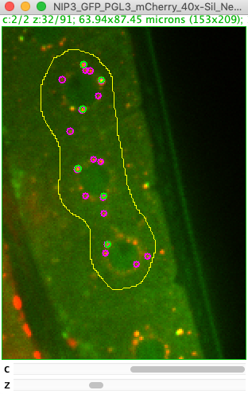
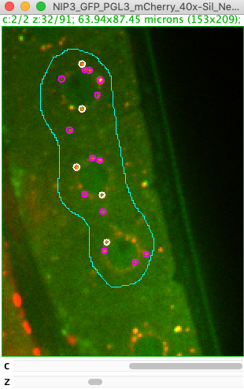

# Spot Colocalizer (3D)
These are plugins to quantify the colocalization of spots in 2D and 3D. 

**Detection of spots is done with a Laplacian of Gaussian filter** ([from Trackmate](https://imagej.net/TrackMate)). **Colocalization is based on the distance between spot centers: Spots are considered colocalized if their centers are less than a user-defined distance (for example the spot radius) apart.** For more details see section "Algorithm details" below. A typical use case would be colocalization analysis of small roundish objects.

The colocalization plugins come in two flavors: `SpotColocalizer Interactive` allows for interactive exploration of parameters. Its friend `SpotColocalizer` does the same but has a simpler GUI and is therefore macro-recordable.
For convenience, there are additionally two plugins available which only do the detection step: `SpotDetector Interactive` and `SpotDetector`.

All plugins can be found under the menu entry *Plugins > Spot Colocalization*.

The input image can be 2D or 3D and must be a single timepoint.

# Installation
* In Fiji, the plugins are distributed via an update site: Activate the *SCF-MPI-CBG* update site.
* See [here](https://imagej.net/How_to_follow_a_3rd_party_update_site) for general instructions on how to follow an update site.


# Spot Colocalization plugins
## SpotColocalizer Interactive plugin

<!-- markdown way of inserting pics: -->

This plugin does spot detection and colocalization analysis for two selected channels in the current image. It allows for **interactive exploration** of parameters. If a ROI is drawn, then the analysis is restricted to this region.

* Menu path: `Plugins > Spot Colocalization > SpotColocalizer Interactive`


#### GUI Parameters:
* `channel number` (for channel A/B): which channel to use for spot detection (one-based)
* `radius (um)` (for channel A/B): approximate radius of spots in um.
* `quality threshold` (for channel A/B): filter out spots which are below this quality. Quality is a measure for spot brightness and how similar the spot size is to the user-provided radius. This parameter is the Trackmate [quality measure](https://imagej.net/TrackMate_FAQ.html#Signification_of_the_Quality_value_in_LoG_Detector.) but scaled with spot size to make it somewhat less dependent on variations in input radius.
* `median filtering` : smooth the image with median filter before detecting spots.
* `coloc distance factor`: Two spots A and B are considered colocalized if their centers are less than `coloc_distance_factor*1/2*(radiusA+radiusB)` apart. If this value is `1` then spots are consdiered colocalized if the distance between their centers is smaller than their mean radius.
* `clear results tables`: clear the table before adding the new results, otherwise results will be appended.
* `add spots to Roi Manager`: adds spots to the Roi Manager als multipoint Rois.
* `Include spots A/B in preview`: When generating a preview (see below), detect and show spots in channel A/B.

</br>




#### Preview: 

Check one or two of the preview checkboxes, then click the  `Generate preview` button. 

Spots are detected in the selected channels and displayed as 3D overlay (i.e. they span multiple slices if the radius is sufficiently large). No colocalization is computed yet. 

The preview is useful to optimize detection parameters.

</br>

#### Outputs:

Use the `Full Colocalization Analysis` button to run detection and colocalization analysis. Computed outputs are:



* **`Overlay on Image`**: detected spots are displayed as (3D) overlay in different colors.
	* *magenta*: channel A not-colocalized, *green*: channel B not-colocalized, *white*: colocalized spots
	* A colocalized spot is drawn at the mean position and with mean radius of the colocalized spot-pair.
* **`Detailed Results Spot Colocalization table`**: Every row corresponds to a detected spot in either of the channels. Features like radius and intensity are obtained from the Trackmate detector. The last column tells whether the spot was colocalized.
	* *z(pixel)* is zero-based. Add +1 to compute slice number.
	* *mean_intensity* is computed within the provided input radius. This may or may not be a good measure for your data.
	* The colocalized spots are sorted: The 1st, 2nd,.. spot in the list from channel A which is classified as colocalized corresponds to the 1st, 2nd,.. spot of channel B that is classified as colocalized.


* **`Summary Counts Spot Colocalization table`**: Provides summary statistics of how many spots were detected in each channel and how many were colocalized.


* **`MultiPoint Rois in Roi Manager`**: Four multipoint Roi's are created: Points are separated by channel, and by whether they were colocalized.
	* The point rois are associated to a specific channel, and each point to a specific slice.


#### Tips:
* After finishing, close the plugin GUI manually.
* To change the active image: close the plugin, select the new image, open the plugin again.
* If detection is slow optimize the parameters first on a small Roi region.

</br>

## SpotColocalizer plugin


This plugin does exactly the same analysis as `SpotColocalizer Interactive` but has a simpler GUI and is therefore **macro-recordable**. It does not have preview functionality.

* Menu path: `Plugins > Spot Colocalization > Macro Recordable > SpotColocalizer`

</br></br>

# Spot Detection plugins
## SpotDetector Interactive plugin


This plugin does spot detection in one selected channel of the current image. It allows for **interactive exploration** of parameters. The used detection process is identical to the first step of the colocalization plugins. If a ROI is drawn, then analysis is restricted to this region.

**Note**: *This plugin is a thin wrapper around the TrackMate spot detector and identical results could be obtained with the TrackMate GUI*. It exists mostly for convenience when tracking is not needed.

* Menu path: `Plugins > Spot Colocalization >  SpotDetector Interactive`


#### GUI Parameters:
For description, see corresponding parameters in `SpotColocalizer Interactive`.

#### Preview: 
Press the `Generate preview` button. Detected spots are displayed as (3D) overlay.


#### Outputs:

Use the `Full Spot Detection` button to run detection. Computed outputs are:

* `Overlay on Image`: detected spots are displayed as (3D) overlay in magenta.
* `Results Spots Detection table`: Each row corresponds to a detected spot. Features like radius and intensity are obtained from the Trackmate detector.
	* *z(pixel)* is zero-based. Add +1 to compute slice number.
	* *mean_intensity* is computed within the provided input radius. This may or may not be a good measure for your data.


* `MultiPoint Roi in Roi Manager`: One multipoint Roi with all detected spots is created.
	* The point rois are associated to a specific channel, and each point to a specific slice.

</br>

## SpotDetector plugin


This plugin does exactly the same analysis as `SpotDetector Interactive` but has a simpler GUI and is therefore **macro-recordable**. It does not have preview functionality.

* Menu path: `Plugins > Spot Colocalization > Macro Recordable > SpotDetector`


</br>
</br>


# Algorithm details
### Spot detection
* For spot detection we fully rely on the [TrackMate LoG Detector](https://imagej.net/TrackMate): The image is convolved with a Laplacian of Gaussian (LoG) filter and spots are detected as maxima within the convolved image. Each spot has a quality assigned (based on spot size and brightness) which can be used for filtering.

### Spot colocalization
* Input for colocalization quantification are two lists of spots, one each from channel A and B.
* For each spot from channel A the closest spot from channel B is searched. If this spot pair is closer than the accepted threshold distance the spots are marked as colocalized, otherwise not.
* Theoretically, it would be possible that a spot from channel B is the best and accepted match to two channel A spots (although this requires a very high spot density). To avoid such double assignments a greedy algorithm is used: The first found spot-pair is accepted, then the spots from this pair are removed from the list of potential matches.
	* Note: While not globally optimal, the limitations of this approach should be irrelevant for biological spot densities.


# Macro recording & scripting
### Macros
The non-interactive plugin versions `SpotColocalizer` and `SpotDetector` can be macro-recorded. Example output of recording:
````
// Spot Detection
run("SpotDetector", "channel=1 radius_um=0.9 threshold=5000.0 domedian=false cleartable=false addtoroimanager=true");
````
````
// Spot Colocalization
run("SpotColocalizer", "channela=1 radiusa_um=0.9 thresholda=5000.0 channelb=2 radiusb_um=0.9 thresholdb=4000.0 domedian=false distancefactorcoloc=1.0 cleartable=false addtoroimanager=true");
````
### Scripting (jython etc.)
The plugins can be recorded just like for the macro language. Alternatively, it is also possible to access the functions directly via the *`SpotProcessor`* class:
```python
# Examples of running some substeps of the spot-colocalizer via lower level access
# see also https://github.com/walkernoreen/spot_colocalizer/blob/master/src/main/java/de/mpicbg/scf/spotcoloc/SpotProcessor.java
# steps in runFullColocalizationAnalysis(...)

from ij import IJ
from de.mpicbg.scf.spotcoloc import SpotProcessor

# specify detector and colocalizer parameters
channelA=1
radiusA_um=0.9
thresholdA=5000
channelB=2
radiusB_um=0.9
thresholdB=4000
distanceFactorColoc=1
doSubpixel=True
doMedian=True

# process current image (>=2 channels)
imp=IJ.getImage()

imp.setOverlay(None)

# initialize a spot processor instance
spotProcessor = SpotProcessor(imp)

# detect spots (lists of trackmate spot objects)
spotsA = spotProcessor.detectSpots(channelA, radiusA_um,thresholdA, doSubpixel, doMedian)
spotsB = spotProcessor.detectSpots(channelB, radiusB_um, thresholdB, doSubpixel, doMedian)

# find colocalized spots
maxdist_um = 0.5 * (radiusA_um + radiusB_um) * distanceFactorColoc
CR = spotProcessor.findSpotCorrespondences(spotsA, spotsB, maxdist_um) 
# colocalization result CR: fields are lists of spots, split by channel and colocalization: CR.spotsA_coloc, CR.spotsA_noncoloc, etc.

# print a summary
print "\nDetected spots channel A: colocalized: ",len(CR.spotsA_coloc),", not colocalized: ",len(CR.spotsA_noncoloc)
print "Detected spots channel B: colocalized: ",len(CR.spotsB_coloc),", not colocalized: ",len(CR.spotsB_noncoloc)

# print the coordinates of all spots in channel A which were colocalized
print "\nCoordinates of colocalized spots channel A (in um):"
for spot in CR.spotsA_coloc:
	print "x=",spot.getDoublePosition(0),", y=",spot.getDoublePosition(1),", z=", spot.getDoublePosition(2)

```


# Additional information
### Colocalization analysis
* "Colocalization analysis" can mean various methods of analyzing the spatial co-occurence of two signals. Before doing the analysis it is important to select the right method that fits your data. There are two main categories:
	1. **Intensity based correlation analysis**. These methods quantify colocalization as correlation of pixel intensities with Pearson correlation coefficient, Manders, Costes etc. ([see here for introduction](https://imagej.net/Colocalization_Analysis)).
	2. **Object based colocalization**. Here, objects are first detected/segmented and then the overlap of objects from the two different channels is quantified. **Spot colocalization** (this plugin here), where spot centers are detected and colocalization is quantified as distance between spot centers, is a special case of object-based analysis. It is suitable for small roundish objects. 
* For an excellent introduction on colocalization and a helpful flow-chart for choosing a good analysis method see for example [BioImage Data Analysis Workflow, 2020 (chapter 3)](https://www.springer.com/gp/book/9783030223854).
* Even before analysis, it is important to acquire images suitable for colocalization quantification, that is, without bleedthrough between channels, without chromatic shift (or it must be corrected for), etc. etc. ([some acquisition tips here](https://imagej.net/Colocalization_-_hardware_setup_and_image_acquisition)).

### Other plugins
An incomplete list of other plugins for spot-based colocalization analysis:
* [ComDet](https://imagej.net/Spots_colocalization_(ComDet)) : spot colocalization in 2D, can also handle variable spot size.
* [Distance Analysis (DiAna)](https://imagejdocu.tudor.lu/doku.php?id=plugin%3Aanalysis%3Adistance_analysis_diana_2d_3d_%3Astart) Colocalization and Distance analysis in 3D.
* [MorpholibJ Label Overlap Measures](https://imagej.net/MorphoLibJ.html#Label_Overlap_Measures): General purpose quantification of overlaps for segmented objects.

</br>

**Image source:** The used example image on this page was kindly provided by Andre Greiner, MPI-CBG.
