* This is a collection of plugins for detecting spots and doing colocalization analysis between spots in 3D and 2D. Spots are detected with a Laplacian of Gaussian filter (by Trackmate plugin TODO link). For computing colocalization we measure the distance between spot centers: Spots are considered colocalized if their centers are less than a user-defined distance (for example the spot radius) apart. 

* A typical use case would be colocalization analysis of small roundish objects.
* For details on the implementation please see section "Algorithm details" below.

* The plugins come in a couple of flavors:
	* `SpotColocalization Interactive`: Does spot detection in 2 selected channels and analyzes colocalization between the spots.
	* `SpotColocalization`: macro-recordable version of `Spot Colocalization Interactive`.
	* `SpotDetection Interactive` Does spot detection in 1 selected channel. This is basically the first part of the colocalization plugin.
	* `SpotDetection`: macro-recordable version of `Spot Detection Interactive`.


#### Suitable input data
* The plugins can handle:
* 2D or 3D, single channel (only for detection) or multichannel composite (for detection and colocalization), single timepoint. TODO nicer


## Spot Colocalization
### `SpotColocalizer Interactive`: Interactive exploration
* Menu path: `Plugins > Spot Colocalization > SpotColocalizer Interactive`
* This plugin does spot detection and colocalization analysis for 2 selected channels in the current image. It allows for interactive exploration of parameters.
* If a ROI is drawn, then analysis is restricted to this region.
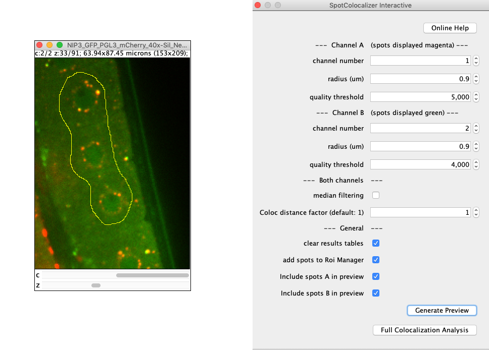
* TODO somehwere: image courtesy: Andre Greiner, MPI-CBG

#### Parameters
* `channel number` (for channel A/B): which channel to use for spot detection (one-based)
* `radius (um)` (for channel A/B): approximate radius of spots in um (see also TODO link to: Trackmate parameters).
* `quality threshold` (for channel A/B): filter out spots which are below this quality. Quality is roughly determined by spot brightness and how close its size is to the input radius. This parameter is the Trackmate quality measure (TODO link) but scaled with spot size to make it somewhat less dependent on variations in input radius.
* `median filtering` : smooth the image with median filter before detecting spots
* `coloc distance factor`: Two spots A and B are considered colocalized if their centers are less than `coloc_distance_factor*0.5*(radiusA+radiusB)` apart. If this value is `1` then spots are colocalized if the distance between their centers is smaller than their mean radius.
* `clear results tables`: clear the table before adding the new results, otherwise results will be appended.
* `add spots to Roi Manager`: adds spots to the Roi Manager als multipoint Rois.
* `Include spots A/B in preview`: When generating a preview (see below), detect and show spots in channel A/B.

#### Preview: 
* Use the `Generate preview` button, and select beforehand either one or both of the preview checkboxes above.
* Spots are detected and displayed as overlay. (TODO: where to put the lines below)
	* Detection is in 3D and spots are displayed as 3 dimensional overlays (i.e. in multiple slices if they are big enough).
	* Spots of channel A resp. B are displayed in magenta, resp. green.
* No colocalization is computed yet.
* The preview is useful to optimize parameters.

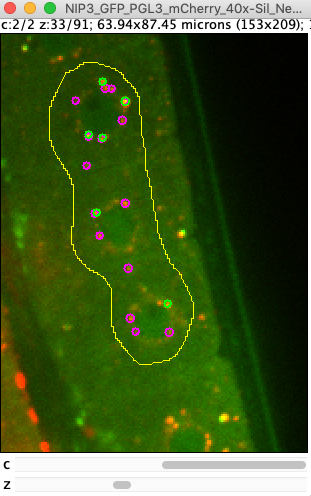


#### Output:
* Use the `Full Colocalization Analysis` button to run detection and colocalization analysis. Computed outputs are:
* `Overlay on Image`: detected spots are displayed as (3D) overlay in different colors.
	* channel A not-colocalized: magenta, channel B not-colocalized: green, colocalized spots: white
	* A colocalized spot is drawn at the mean position and with mean radius of the colocalized spot-pair.

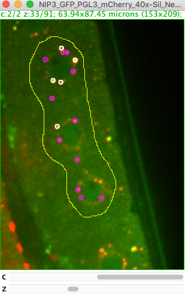

* `Detailed Results Spot Colocalization table`: Each detected spot is listed in this table. The computed features are taken from the TrackMate detector. For details see [TODO]. The last column states whether the spot was colocalized.
	* Important:
		* The colocalized spots are sorted: The 1st, 2nd,.. spot in the list in channel A which is classified colocalized corresponds to the 1st, 2nd,.. spot of channel B that is classified colocazized.
		* z(pixel) is zero-based. Add +1 to compute slice number.
		* mean_intensity is computed within the provided input radius which may or may not be suitable for your data.

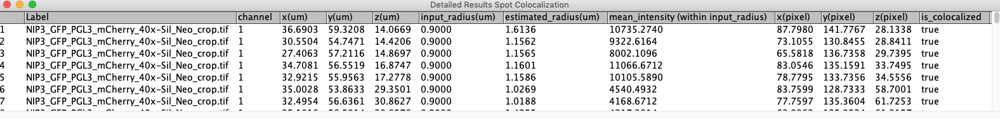

* `Summary Counts Spot Colocalization table`: Provides summary statistics of how many spots were detected in each channel and how many were colocalized.
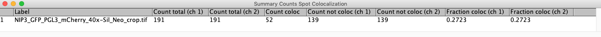

* `MultiPoint Rois in Roi Manager`: Four multipoint Roi's are created: Points are separated by channel, and by whether they were colocalized.
	* The point rois are associated to a specific channel, and each point to a specific slice.
	* An easy way to recover statistics similar to the detailed results table would be the `Measure` button in the Roi Manager. (TODO remove this?)

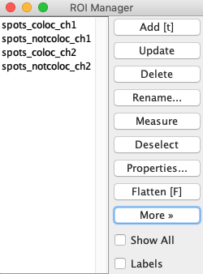


#### Tips:
* After finishing, close the plugin GUI manually.
* To change the active image: close the plugin, select the new image, open the plugin again.
* If detection is slow optimize the parameters first on a small Roi region.


### `SpotColocalizer`: Macro-recordable version
* Menu path: `Plugins > Spot Colocalization > Macro Recordable > SpotColocalizer`
* This plugin does exactly the same analysis as `SpotColocalizer Interactive` but has a simpler GUI and is therefore macro-recordable.
* It does not have preview functionality.
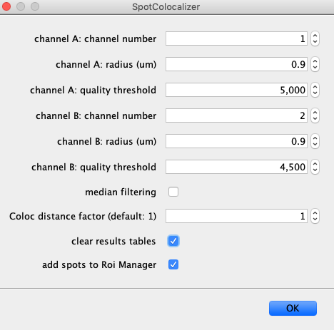


## Spot Detection
### `SpotDetector Interactive`: Interactive exploration
* Menu path: `Plugins > Spot Colocalization >  SpotDetector Interactive`
* This plugin does spot detection in 1 selected channel in the current image. It allows for interactive exploration of parameters. The used detection process is identical to the first step of the colocalization plugins.
* Note: *This plugin is a thin wrapper around the TrackMate spot detector and identical results could be obtained with the TrackMate GUI*. It exists mostly for convenience when tracking is not needed.
* If a ROI is drawn, then analysis is restricted to this region.

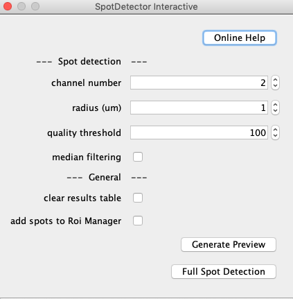


#### Parameters
* for description, see respective parameters in `SpotColocalizer Interactive`.

#### Preview: 
* Use the `Generate preview` button. Detected spots are displayed as (3D) overlay.

#### Output:
* Use the `Full Spot Detection` button to run detection. Computed outputs are:
* `Overlay on Image`: detected spots are displayed as (3D) overlay in magenta.

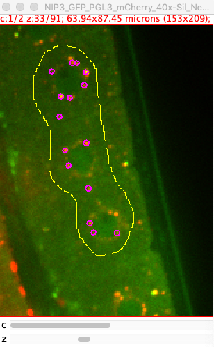

* `Results Spots Detection table`: Each detected spot is listed in this table. The computed features are taken from the TrackMate detector. For details see [TODO]. 
	* Important:
		* z(pixel) is zero-based. Add +1 to compute slice number.
		* mean_intensity is computed within the provided input radius which may or may not be suitable for your data.

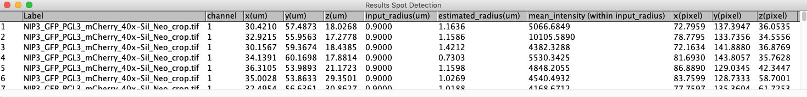


* `MultiPoint Roi in Roi Manager`: One multipoint Roi with all detected spots is created.
	* The point rois are associated to a specific channel, and each point to a specific slice.
	* An easy way to recover statistics similar to the detailed results table would be the `Measure` button. (TODO remove this?)

### `SpotDetector`: Macro-recordable version
* Menu path: `Plugins > Spot Colocalization > Macro Recordable > SpotDetector`
* This plugin does exactly the same analysis as `SpotDetector Interactive` but has a simpler GUI and is therefore macro-recordable.
* It does not have preview functionality.
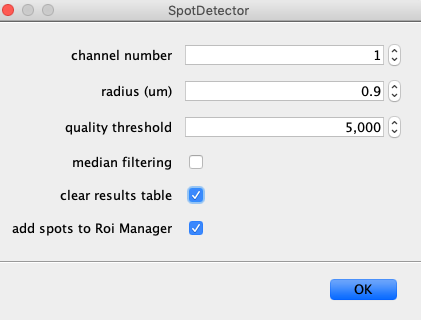


## Algorithm details: How detection and colocalization is computed
#### Spot detection
* For spot detection we fully rely on the TrackMate plugin.
* refer to Trackmate (+adjusted threshold) TODO here

#### Spot colocalization
* 	* mention the greedy algorithm to avoid double assignments
* TODO here


## Macro recording & scripting
#### Macros
* The non-interactive plugin versions `SpotColocalizer` and `SpotDetector` can be macro-recorded.
* Example output of recording:
````
// Spot Detection
run("SpotDetector", "channel=1 radius_um=0.9 threshold=5000.0 domedian=false cleartable=false addtoroimanager=true");
````
````
// Spot Colocalization
run("SpotColocalizer", "channela=1 radiusa_um=0.9 thresholda=5000.0 channelb=2 radiusb_um=0.9 thresholdb=4000.0 domedian=false distancefactorcoloc=1.0 cleartable=false addtoroimanager=true");
````
#### Scripting (jython etc.)
* The plugins can be recorded just like for the macro language.
* Alternatively, it is also possible to access the functions directly via the `SpotProcessor` class:
```python
# Examples of running some substeps of the spot-colocalizer via lower level access
# see also https://github.com/walkernoreen/spot_colocalizer/blob/master/src/main/java/de/mpicbg/scf/spotcoloc/SpotProcessor.java
# steps in runFullColocalizationAnalysis(...)

from ij import IJ
from de.mpicbg.scf.spotcoloc import SpotProcessor

# specify detector and colocalizer parameters
channelA=1
radiusA_um=0.9
thresholdA=5000
channelB=2
radiusB_um=0.9
thresholdB=4000
distanceFactorColoc=1
doSubpixel=True
doMedian=True

# process current image (>=2 channels)
imp=IJ.getImage()

imp.setOverlay(None)

# initialize a spot processor instance
spotProcessor = SpotProcessor(imp)

# detect spots (lists of trackmate spot objects)
spotsA = spotProcessor.detectSpots(channelA, radiusA_um,thresholdA, doSubpixel, doMedian)
spotsB = spotProcessor.detectSpots(channelB, radiusB_um, thresholdB, doSubpixel, doMedian)

# find colocalized spots
maxdist_um = 0.5 * (radiusA_um + radiusB_um) * distanceFactorColoc
CR = spotProcessor.findSpotCorrespondences(spotsA, spotsB, maxdist_um) 
# colocalization result CR: fields are lists of spots, split by channel and colocalization: CR.spotsA_coloc, CR.spotsA_noncoloc, etc.

# print a summary
print "\nDetected spots channel A: colocalized: ",len(CR.spotsA_coloc),", not colocalized: ",len(CR.spotsA_noncoloc)
print "Detected spots channel B: colocalized: ",len(CR.spotsB_coloc),", not colocalized: ",len(CR.spotsB_noncoloc)

# print the coordinates of all spots in channel A which were colocalized
print "\nCoordinates of colocalized spots channel A (in um):"
for spot in CR.spotsA_coloc:
	print "x=",spot.getDoublePosition(0),", y=",spot.getDoublePosition(1),", z=", spot.getDoublePosition(2)

```


## Further resources, other plugins
#### Some background and further resources [TODO other name?]
* Colocalization analysis can be tricky and people often mean different things when talking about colocalization. [ToDo better]
* On the simplest level we can distinguish between intensity based analysis (Pearson, Manders,...), and object based analysis (spot detection with spot distance analysis , object segmentation with volume overlap analysis, ...). The plugin of this page here is suitable for object based analysis for small roundish objects.
* Before choosing a method make sure you know what type of analysis you need and that your images are acquired appropriately (e.g. no bleed-through, no chromatic aberration (or corrected for), ...).
* For an excellent introduction on colocalization and a helpful flow-chart for choosing a good analysis method see for example : [BioImage Data Analysis Workflow, 2020 (chapter 3)](https://www.springer.com/gp/book/9783030223854)
* There's also the Colocalization wiki page [TODO link]

#### Other plugins
* ComDet[link] : spot colocalization in 2D, can handle also variable spot size
* MorpholibJ: XXXoverlap measure: can be used to compute colocalization (as overlap measure) of segmented objects
* Coloc2: intensity based colocalization analysis
* and probably many more plugins ...

